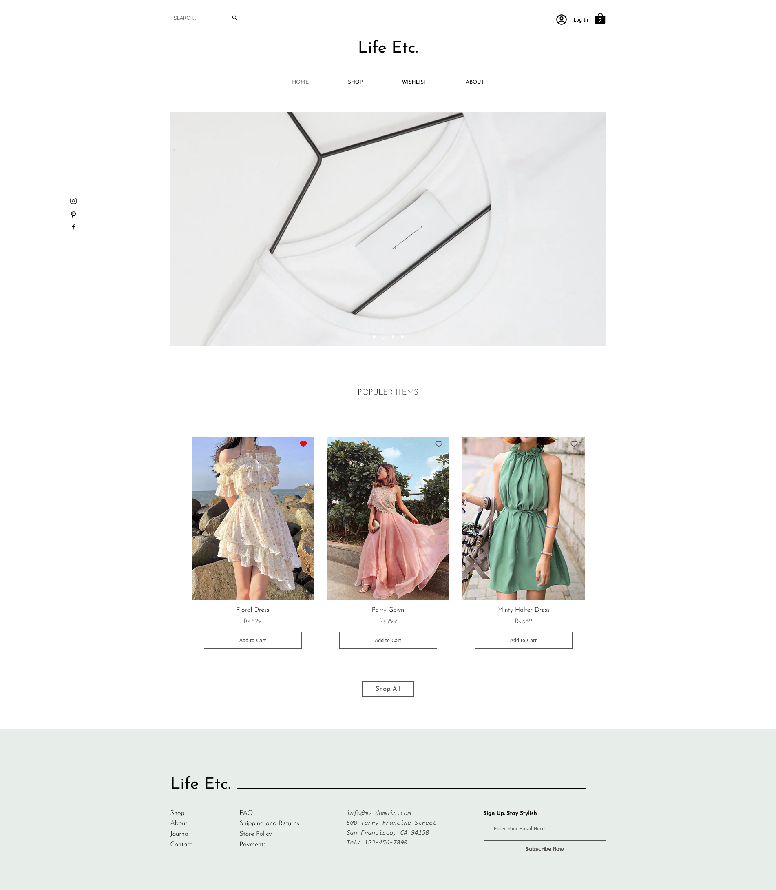
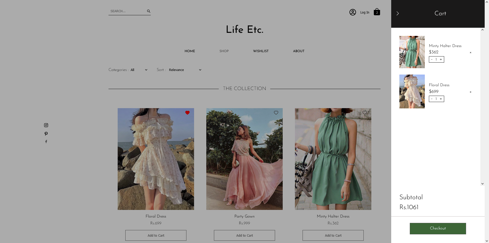
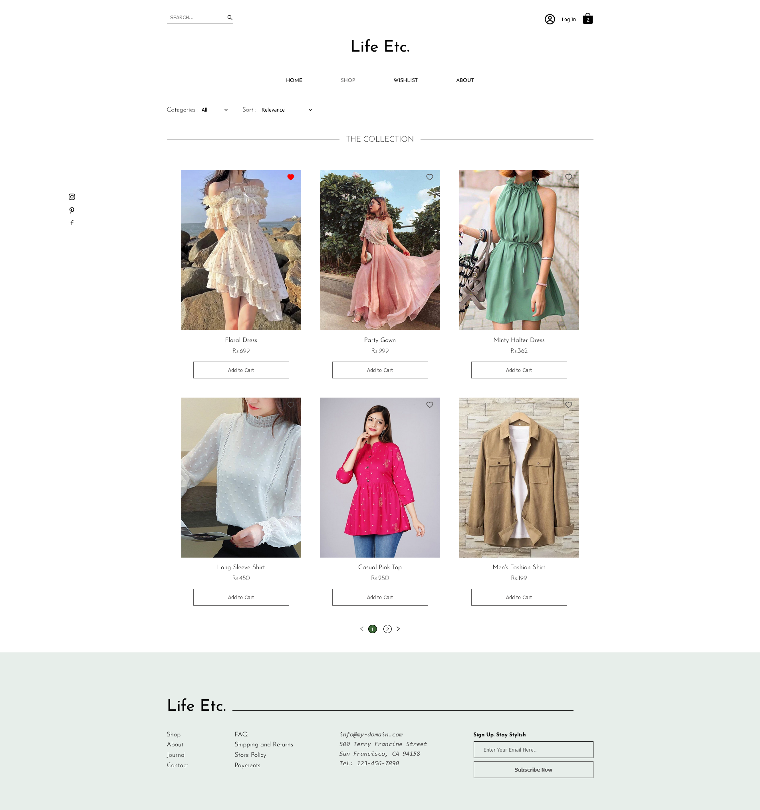
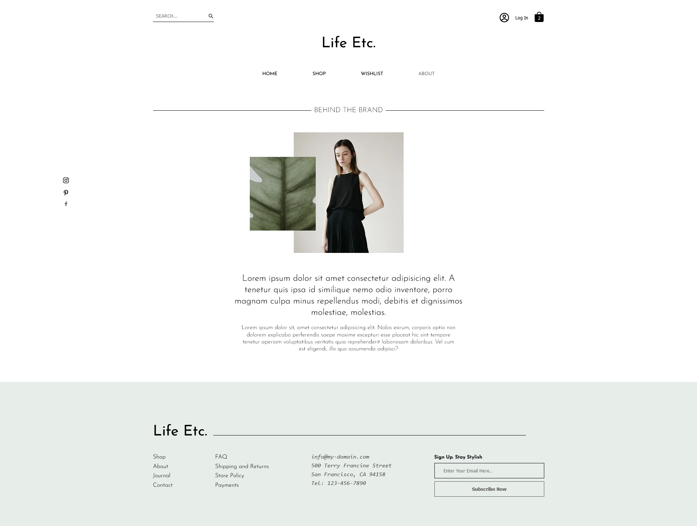

# E-commerece website

## Demo link

Access this live site at: [Life Etc.](https://e-commerce-next-js-website.vercel.app/) 

## About the app

Life Etc. is an online clothing store personal project built with NextJs. This is a responsive website which works on different screen sizes. 

## Screenshots

***

***

***

## Technologies

I used..
- NextJS
- ReactJs
- Css 
- stripe: payments
- Auth0 

## Folder Structure

- `/app`: Contains the main pages of the application.
- `/api`: Handles the stripe payment route
- `/components`: Holds reusable components used across the app.
- `/public`: Contains images and icons
- `/lib`: Contains helper functions
- `/app/globals.css`: Stores global and component-specific styles.
- `/data`: Contains the website products data and helper functions.
- `CartContext.jsx`: Has the react's useContext hook and holds the overall functioning of cart data throughout our app.
- `/components/Modal.jsx`: Is the cart component

## Journey
- My main goal with this project was to learn the basic working of front-end of an e-commerce website. 
- I started out by planning the main page and the number of pages this website might have.
- Got the design idea from a wix clothing store template since it had similar features which I initially planned with my project.
- Proceeded by writing the logic and styling it simultaneously.
- Created separate css modules for each page and components.
- Learnt about the usage of react hook useContext to pass cart data throughout the app.
- Brushed upon my pure css skills with this project, since I only used Tailwind for the past few projects.
- Learnt about the integration of online payments using Stripe payments.
- Learnt Authentication using Auth0.

## Final thoughts
 I might add some new features to this website as I learn new things.
 I really wish to learn and create websites with beautiful scrolling and interactive ui in the future..

## Credits
- [Wix online clothing store template](https://www.wix.com/website-template/view/html/2348?originUrl=https%3A%2F%2Fwww.wix.com%2Fwebsite%2Ftemplates%2Fhtml%2Fonline-store&tpClick=view_button&esi=bb5919bc-f10b-41c6-afcb-4533ffcaf6f2)
- [Using stripe youtube video by traversy media](https://youtu.be/_8M-YVY76O8)

## contributer
- [Harshita Naik](https://github.com/Harshita-Naik16)

 *Any suggestions are heartly welcomed!*
